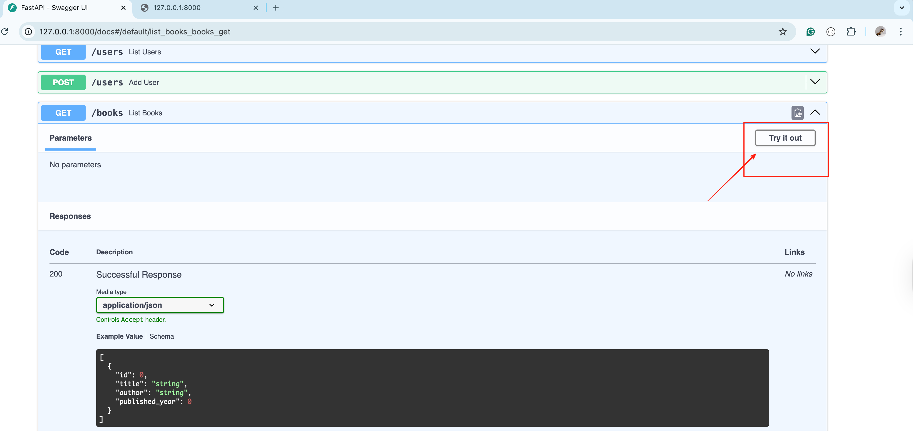
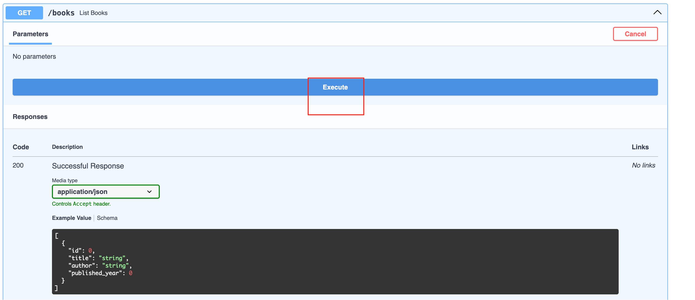
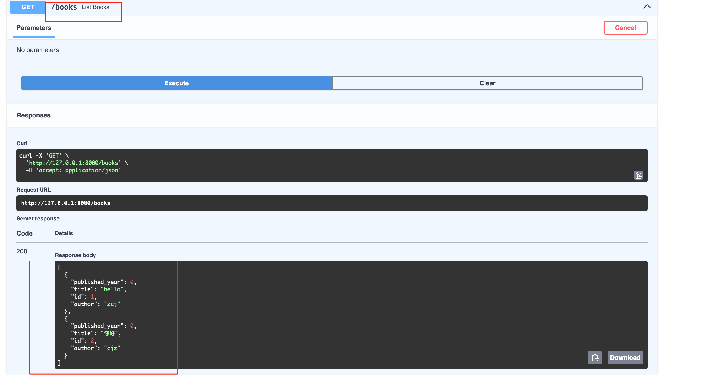
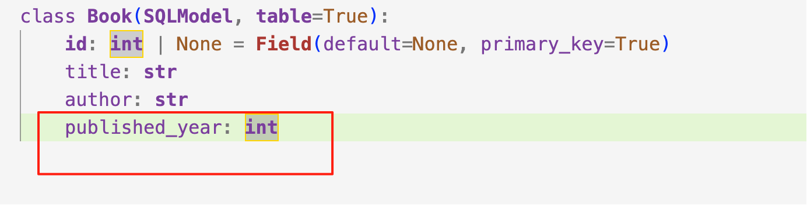
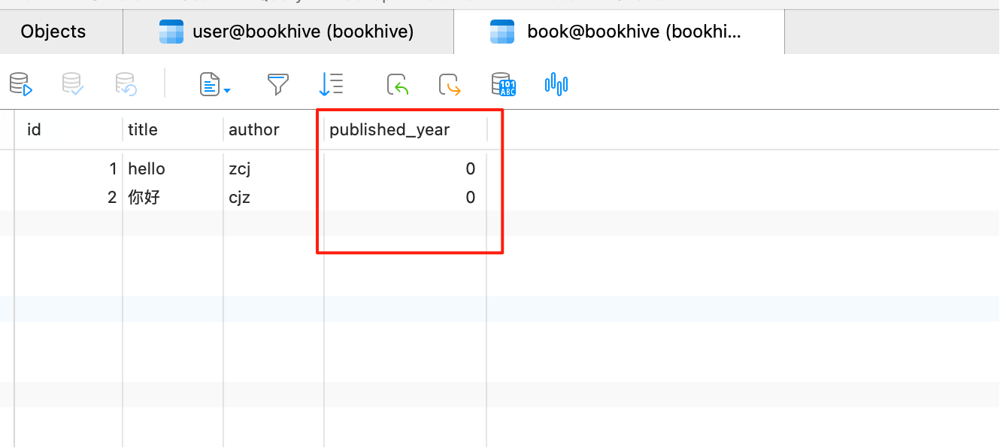

# BookHive

## 1. Install Dependencies

```bash
pip install --upgrade pip
pip install -r requirements.txt
```

## **2. Configure Environment (.env)**

Copy the example file and update your credentials:

```
cp .env.example .env
```

Edit .env:

```
SSH_HOST=3.25.176.34
SSH_PORT=22
SSH_USER=ec2-user
SSH_KEY_PATH=/Users/yourname/.ssh/your-key.pem

REMOTE_DB_HOST=your-rds-endpoint.ap-southeast-2.rds.amazonaws.com
REMOTE_DB_PORT=3306

LOCAL_PORT=3307
DB_USER=admin
DB_PASS=yourpassword
DB_NAME=bookhive
```

## **3. Start the Project**

### 3.1 Run with Uvicorn:

```
uvicorn app.main:app --reload
```

Visit:

- API: http://127.0.0.1:8000
- Docs: http://127.0.0.1:8000/docs


At http://127.0.0.1:8000/docs, once you expand an endpoint, click the `Try it out` button, and then click the `Execute` button.






After execution, you’ll see  the Response:




### 3.2 You may encounter the following error:

```
ERROR:    [Errno 48] Address already in use
```

#### 3.2.1. Check which process is using port 8000

```
lsof -i :8000
```

Example output:

```
COMMAND     PID            USER   FD   TYPE             DEVICE SIZE/OFF NODE NAME
python3.1 83984 zhangchangjiang    3u  IPv4 ...      0t0  TCP localhost:8000 (LISTEN)
python3.1 84407 zhangchangjiang    3u  IPv4 ...      0t0  TCP localhost:8000 (LISTEN)
```

#### 3.2.2 Kill the processes occupying the port

```
kill -9 83984
kill -9 84407
```

[Re-execute Step 3.1 Run with Uvicorn]()


## 4. Database Migration (Alembic)

Whenever your SQLModel models change (e.g. add/edit/delete fields or tables), follow these steps to apply the changes to the database:

### 4.1 Generate migration script:

```
alembic revision --autogenerate -m "describe your change"
```

### 4.2 Apply changes to Database:

```
alembic upgrade head
```

### 4.3 Example

When I run `alembic revision --autogenerate -m "add published_year to book"` and  `alembic upgrade head`, Alembic generates a new migration script that adds the `published_year` field to the `book` table.





