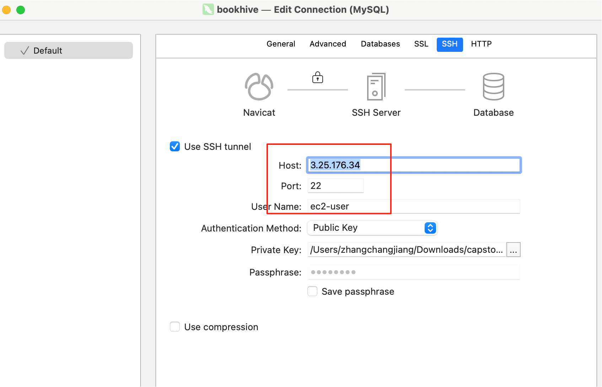
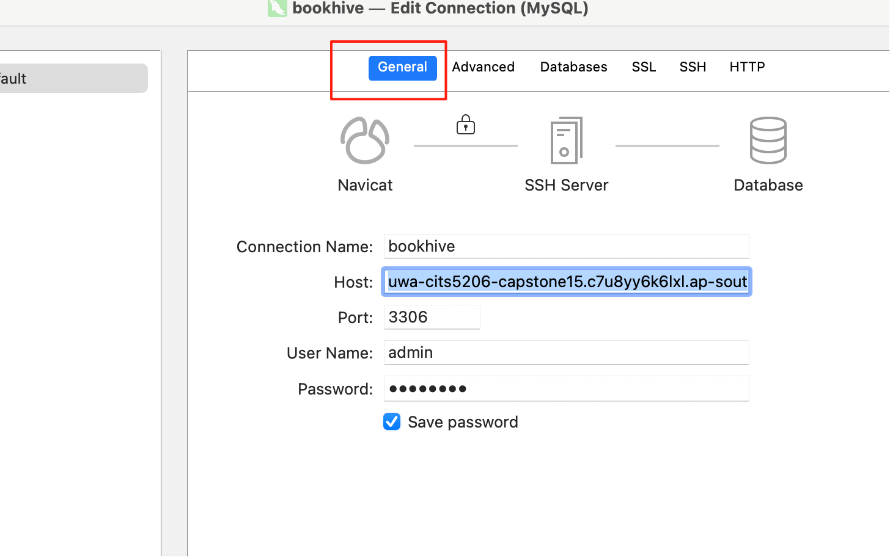
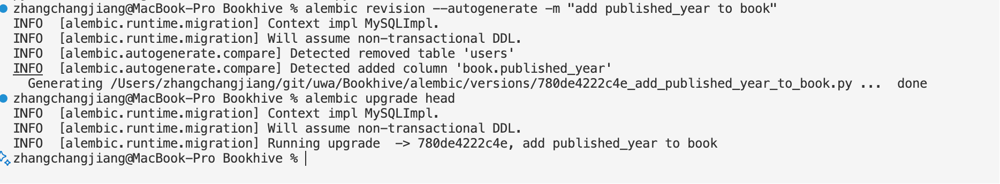
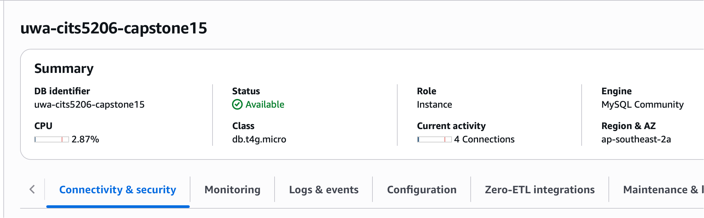
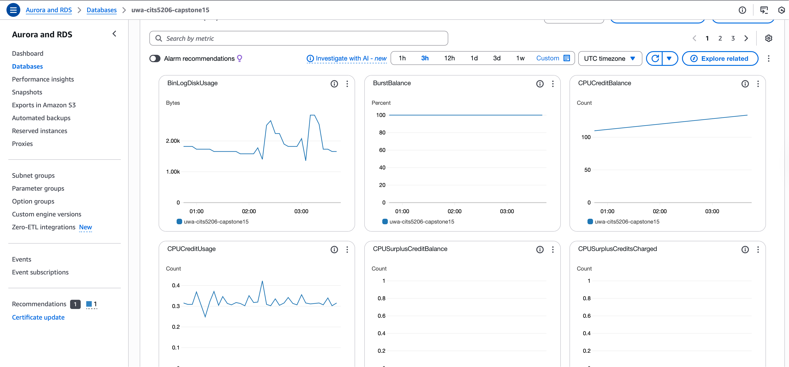

# BookHive

## Overview

| **Layer**      | **Tech Used**                             | **Description**                                     |
| -------------- | ----------------------------------------- | --------------------------------------------------- |
| API Framework  | [FastAPI](https://fastapi.tiangolo.com)   | Lightweight, high-performance Python web framework  |
| ORM + Models   | [SQLModel](https://sqlmodel.tiangolo.com) | Combines SQLAlchemy + Pydantic for defining models  |
| Database       | AWS RDS (MySQL)                           | Managed cloud DB, connected via SSH                 |
| Migration Tool | Alembic                                   | Tracks model changes and auto-generates SQL scripts |
| Deployment     | Local + SSH tunnel                        | Local dev runs via uvicorn, tunnels to AWS RDS      |
| API Docs       | Swagger (via FastAPI)                     | Available at /docs                                  |

## Folder Structure

```
bookhive/
├── app/
│   ├── models/         # SQLModel-based database models
│   ├── routes/         # FastAPI route definitions
│   ├── services/       # Business logic (optional abstraction)
│   ├── config.py       # Loads .env configuration
│   ├── db.py           # DB engine init & SSH tunnel
│   └── main.py         # FastAPI app entrypoint
├── alembic/            # Alembic migration versions
├── alembic.ini         # Alembic config
├── .env / .env.example # Environment config (SSH, DB, etc.)
├── requirements.txt    # Python dependencies
└── README.md
```

## 1. Install Dependencies

You can install all dependencies by running the following command in the directory that contains `requirements.txt`:

```bash
pip install --upgrade pip
pip install -r requirements.txt
```

## **2. Configure Environment (.env)**

Copy the example file and update your credentials:

```
cp .env.example .env
```

Edit .env: use files `3thingsNeedtoModify.txt` in our teams channel.

```
SSH_HOST=3.25.176.34
SSH_PORT=22
SSH_USER=ec2-user
SSH_KEY_PATH=/Users/yourname/.ssh/your-key.pem

REMOTE_DB_HOST=your-rds-endpoint.ap-southeast-2.rds.amazonaws.com
REMOTE_DB_PORT=3306

LOCAL_PORT=3307
DB_USER=admin
DB_PASS=yourpassword
DB_NAME=bookhive
```

## **3. Start the Project**

### 3.1 Run with Uvicorn:

```
uvicorn app.main:app --reload
```

Visit:

- API: http://127.0.0.1:8000
- Docs: http://127.0.0.1:8000/docs


At http://127.0.0.1:8000/docs, once you expand an endpoint, click the `Try it out` button, and then click the `Execute` button.


After execution, you’ll see  the Response:


### 3.2 You may encounter the following error:

```
ERROR:    [Errno 48] Address already in use
```

#### 3.2.1. Check which process is using port 8000

```
lsof -i :8000
```

Example output:

```
COMMAND     PID            USER   FD   TYPE             DEVICE SIZE/OFF NODE NAME
python3.1 83984 zhangchangjiang    3u  IPv4 ...      0t0  TCP localhost:8000 (LISTEN)
python3.1 84407 zhangchangjiang    3u  IPv4 ...      0t0  TCP localhost:8000 (LISTEN)
```

#### 3.2.2 Kill the processes occupying the port

```
kill -9 83984
kill -9 84407
```

[Re-execute Step 3.1 Run with Uvicorn]()


## 4. Database Migration (Alembic)

Whenever your SQLModel models change (e.g. add/edit/delete fields or tables), follow these steps to apply the changes to the database:

### 4.1 Generate migration script:

```
alembic revision --autogenerate -m "describe your change"
```

### 4.2 Apply changes to Database:

```
alembic upgrade head
```

### 4.3 Connect to AWS RDS

#### 4.3.1 Edit SSH

Host: 3.25.176.34

Port: 22

User Name: ec2-user

Authentication Method: Public Key

Private Key: `capstone15keypair.pem` share in our channel.




#### 4.3.2 Edit General infomation: 

Host: uwa-cits5206-capstone15.c7u8yy6k6lxl.ap-southeast-2.rds.amazonaws.com

Port:3306

User Name: admin

Password: share in our channel.




### 4.4 Example

When I run `alembic revision --autogenerate -m "add published_year to book"` and  `alembic upgrade head`, Alembic generates a new migration script that adds the `published_year` field to the `book` table.




## 5. AWS Aurora  and RDS

### TODO: Aurora / RDS - Starter Enhancements, some example

- [ ] **Enable automated backups for RDS**  
      Configure automatic daily backups for data recovery.

- [ ] **Enable slow query logging for performance tuning**  
      Track long-running SQL queries to identify performance issues.

- [ ] **Monitor DB metrics via Amazon CloudWatch**  
      Observe key database metrics like CPU, connections, and storage.

- [ ] **Optimize connection pooling (SQLAlchemy)**  
      Adjust database connection settings for better performance.

- [ ] **Perform regular DB snapshot exports to S3**  
      Archive database snapshots externally for backup and audit.





