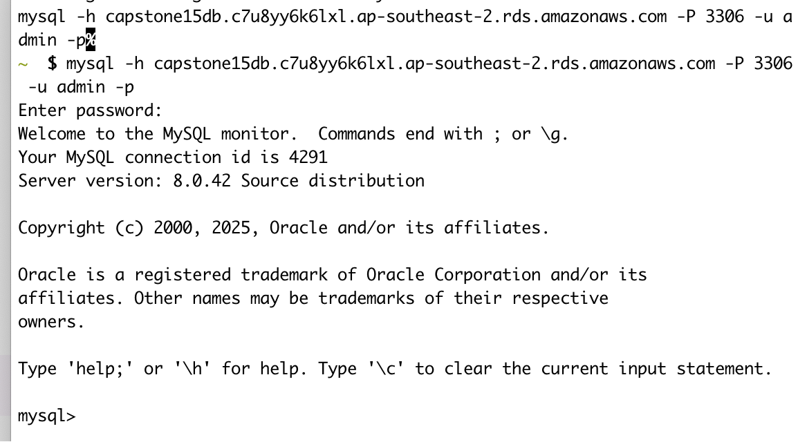
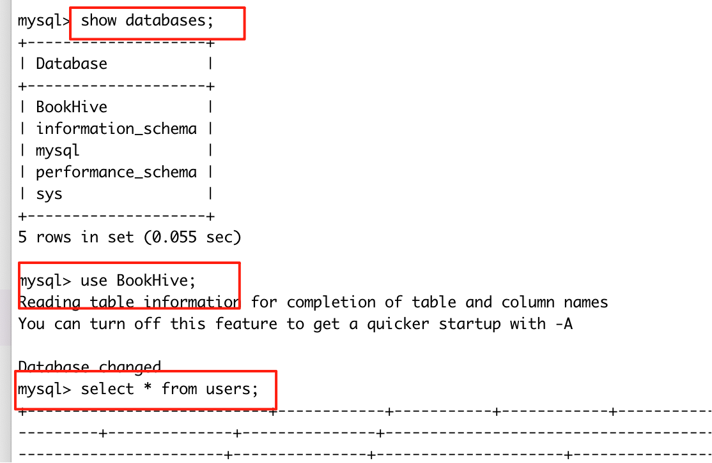

# BookHive FastAPI Backend

This directory contains the FastAPI backend for the BookHive project, focusing on JWT-based authentication (signup/register, login, logout) with MySQL integration. It serves API endpoints for the Next.js frontend in `../capstone-project/`.

## Overview
- **Purpose**: Provides secure authentication APIs using JWT tokens, password hashing (bcrypt), and MySQL for user storage.
- **Tech Stack**: FastAPI, SQLAlchemy (ORM), PyMySQL (MySQL driver), python-jose (JWT), passlib (hashing).
- **Key Features**:
  - User registration with validation (password match, terms agreement).
  - Login with JWT token issuance.
  - Protected endpoints (e.g., /me for user info, /logout).
- **Integration**: Designed to work with the Next.js frontend—endpoints accept JSON/form data and return JWT for session management.

## Requirements
- Python 3.8+.
- MySQL server (e.g., local or remote).
- Dependencies: Listed in `requirements.txt` (install with `pip install -r requirements.txt`).

## Setup
1. **Clone the Repo** (if not already):
   ```
   git clone <repo-url>
   cd BookHive/fastapi
   ```

2. **Install Dependencies**:
   ```
   pip install -r requirements.txt
   ```

3. **Database Setup**:
   
   In the command line, use AWS RDS.
   
   ```bash
   mysql -h capstone15db.c7u8yy6k6lxl.ap-southeast-2.rds.amazonaws.com -P 3306 -u admin -p
   ```
   
   
   
   ```
   show databases;  
   use BookHive;
   ```
   
   Now, we can run query script in mysql command line.
   
   
   
4. **Environment Variables**:
   
   - Copy `../.env.example` to `../.env` (at project root) and fill in values:
     ```
     # Database (required)
     DB_USER=admin
     DB_PASSWORD=12345678
     DB_HOST=capstone15db.c7u8yy6k6lxl.ap-southeast-2.rds.amazonaws.com
     DB_PORT=3306
     DB_NAME=BookHive
     
     # JWT (required)
     SECRET_KEY=your-secure-random-key  # Generate with: python -c 'import secrets; print(secrets.token_hex(32))'
     ALGORITHM=HS256
     ACCESS_TOKEN_EXPIRE_MINUTES=30
     
     # CORS (optional)
     ALLOWED_ORIGINS=http://localhost:3000,http://127.0.0.1:3000
     ```
   - Never commit `.env`—it's in .gitignore.

## Running the Server
- Development (with auto-reload):
  ```
  uvicorn main:app --reload --host 0.0.0.0 --port 8000
  ```
- Production: Remove `--reload` and use a production server like Gunicorn.
- Access: http://localhost:8000 (root), http://localhost:8000/docs (Swagger UI for testing).

## API REFERENCE

authentication:

- **POST /register**
    Endpoint: http://localhost:8000/api/v1/auth/register
    Description: This endpoint allows a new user to register. A JSON body must be provided with name, email, password, confirm_password, and agree_terms. The 
                 server will validate the input and, if valid, create a new account.
    Example Request:
    {
        "name": "Alice",
        "email": "alice@example.com",
        "password": "securePassword123",
        "confirm_password": "securePassword123",
        "agree_terms": true
    }
    Example Response:
    {
        "id": "uuid123",
        "name": "Alice",
        "email": "alice@example.com",
        "location": null,
        "avatar": null,
        "createdAt": "2025-08-24T15:00:00Z"
    }

- **POST /login**: 
    Endpoint: http://localhost:8000/api/v1/auth/login
    Description: This endpoint authenticates a user with their e-mail and password. If the credentials are correct, the server issues a JWT access token that 
                 must be used in the Authorisation: Bearer <token> header for protected routes.
    Example Request:
    {
        "email": "alice@example.com",
        "password": "securePassword123"
    }
    Example Response:
    {
        "access_token": "eyJhbGciOiJIUzI1NiIsInR5cCI6IkpXVCJ9...",
        "token_type": "bearer"
    }

- **POST /logout**: 
    Endpoint: http://localhost:8000/api/v1/auth/logout
    Description: This endpoint logs a user out. It requires a valid JWT in the Authorisation: Bearer <token> header. The server responds with a 
    confirmation message; the client is responsible for discarding the token.
    Example Request:
       None
    Example Response:
    {
        "message": "Successfully logged out"
    }

- **GET /me**: 
    Endpoint: http://localhost:8000/api/v1/auth/me
    Description: This endpoint retrieves information about the currently authenticated user. A valid JWT must be included in the Authorisation: Bearer 
                 <token> header.
    Example Request:
       None
    Example Response:
    {
        "id": "uuid123",
        "name": "Alice",
        "email": "alice@example.com",
        "location": "London",
        "avatar": "https://example.com/avatar.png",
        "createdAt": "2025-08-24T15:00:00Z"
    }          

## Email service:

- **POST /send_verification**:
Endpoint: http://localhost:8000/api/v1/email/send_verification
Description: This endpoint sends a verification email with an OTP code to the specified address. The server temporarily stores the OTP for validation.
Example Request:
{
    "emailAddress": "user@example.com"
}
Example Response:
{
    "message": "Verification email sent successfully."
}


- **POST /verify_otp**:
  Endpoint: http://localhost:8000/api/v1/email/verify_otp
Description: This endpoint verifies the OTP that was previously sent to the user’s email. If the OTP is valid, it is removed from the server.
Example Request:
{
    "emailAddress": "user@example.com",
    "otp": "123456"
}
Example Response (success):
{
    "message": "OTP verified successfully"
}
Example Response (failure):
{
    "detail": "Incorrect OTP"

}

- **POST /send_receipt**:
Endpoint: http://localhost:8000/api/v1/email/send_receipt
Description: This endpoint sends a receipt email containing order details and payment amount to the specified user.
Example Request:
{
    "email": "user@example.com",
    "username": "Alice",
    "total_amount": 120.50,
    "order_id": "ORD-2025-123"
}
Example Response:
{
    "message": "Receipt email sent successfully."

- **POST /send_shipment_confirmation**:
Endpoint: http://localhost:8000/api/v1/email/send_shipment_confirmation
Description: This endpoint sends a shipment confirmation email including tracking number, carrier, and estimated delivery date.
Example Request:
{
    "email": "user@example.com",
    "username": "Alice",
    "order_id": "ORD-2025-123",
    "tracking_number": "TRACK123456",
    "courier_name": "DHL",
    "estimated_delivery_date": "24/09/2025"
}
Example Response:
{
    "message": "Shipment confirmation email sent successfully."
}

## Messaging System
The messaging system allows users to send private messages in real-time using WebSockets, with persistence in the database, read receipts, and unread counts.
                   
### Image Attachments
- Messages can include an optional image attachment. The server validates image type/size and stores files under `/media/messageAttachments/{sender_id}/`.
- Responses and WebSocket payloads include `image_url` when an image is attached.

#### DB Migration
Run this against your existing MySQL database to support image messages (if u have already created the table in mysql, otherwise, just execute the .sql file in docs will do the job):
```sql
ALTER TABLE `messages`
  MODIFY `content` varchar(1000) NULL,
  ADD COLUMN `image_path` varchar(255) NULL AFTER `content`;
```

If recreating the table, ensure `content` is nullable and `image_path` exists.

#### Dependencies
Install Pillow (used for image validation):
```
pip install Pillow
```
Already added in `requirements.txt`.

#### Endpoint: Send Message With Image
- **POST /api/v1/messages/send-with-image**
  - **Headers**: `Authorization: Bearer <token>`
  - **Content-Type**: `multipart/form-data`
  - **Form fields**:
    - `receiver_email` (string, required)
    - `content` (string, optional)
    - `file` (image file, required)
  - **Notes**: Accepts png, jpg/jpeg, gif, webp up to 5MB.
  - **Example (curl)**:
    ```bash
    curl -X POST "http://localhost:8000/api/v1/messages/send-with-image" \
      -H "Authorization: Bearer YOUR_TOKEN" \
      -F "receiver_email=user@example.com" \
      -F "content=Check this out" \
      -F "file=@/path/to/image.jpg"
    ```
  - **Example Response**:
    ```json
    {
      "message_id": "uuid",
      "sender_email": "alice@example.com",
      "receiver_email": "user@example.com",
      "content": "Check this out",
      "image_url": "/media/messageAttachments/<sender_id>/<filename>.jpg",
      "timestamp": "2025-01-15T10:30:00Z",
      "is_read": false
    }
    ```

#### File Storage
- Files are saved to `fastapi/media/messageAttachments/{sender_id}/{uuid.ext}`.
- Static files are served under `/media` (configured in `main.py`). You can open the `image_url` in the browser to verify upload success.

#### WebSocket Payload
When a message is sent, receivers connected via WebSocket get:
```json
{
  "type": "message",
  "data": {
    "sender_email": "alice@example.com",
    "content": "Hello",
    "image_url": "/media/messageAttachments/<sender_id>/<filename>.jpg",
    "timestamp": "2025-01-15T10:30:00Z"
  }
}
```

### Setup
1. **Install Dependencies**:
   - Ensure `websockets` is installed: `pip install websockets`.
   - If not already, install core dependencies: `pip install -r requirements.txt`.

2. **Database Configuration**:
   - Update your database schema to include the `messages` table. Run the SQL script in `docs/sql-script/BookHive.sql` against your MySQL database (e.g., via MySQL Workbench or CLI: `mysql -h yourhost -u youruser -p yourdb < BookHive.sql`).
   - If using migrations (e.g., Alembic), set it up in `database/` and run `alembic upgrade head`.

3. **Environment Variables**:
   - No additional .env vars needed beyond the base setup (e.g., DATABASE_URL, JWT_SECRET).

4. **Frontend Integration**:
   - In your Next.js app (e.g., `frontendNext/`), add WebSocket handling: Connect to `ws://your-api-url/api/v1/messages/ws?token={jwt_token}`.
   - Example in JavaScript: 
     ```javascript
     const ws = new WebSocket('ws://localhost:8000/api/v1/messages/ws?token=' + token);
     ws.onmessage = (event) => {
       const data = JSON.parse(event.data);
       if (data.type === 'message') {
         // Handle new message
         console.log('New message:', data.data);
       }
     };
     ```
   - Handle reconnections and errors for production.

5. **Troubleshooting**:
   - WebSocket connection fails: Check JWT token validity and server logs for authentication errors.
   - Messages not persisting: Verify database connection in `database/connection.py`.
   - Test: Use tools like wscat (`npm install -g wscat`) – `wscat -c "ws://localhost:8000/api/v1/messages/ws?token=your_token"`.

### Endpoints
- **POST /api/v1/messages/send**: Send a message to another user and notify them via WebSocket.
  - **Headers**: `Authorization: Bearer <token>`
  - **Example Request**:
    ```json
    {
      "receiver_email": "user@example.com",
      "content": "Hello! How are you?"
    }
    ```
  - **Example Response**:
    ```json
    {
      "message_id": "msg123456789",
      "sender_email": "alice@example.com",
      "receiver_email": "user@example.com",
      "content": "Hello! How are you?",
      "timestamp": "2025-01-15T10:30:00Z",
      "is_read": false
    }
    ```
  - **Notes**: Triggers real-time WebSocket notification to the receiver if connected.

- **GET /api/v1/messages/conversation/{other_user_email}**: Get all messages in a conversation between current user and another user.
  - **Headers**: `Authorization: Bearer <token>`
  - **Example Response**:
    ```json
    [
      {
        "message_id": "msg123",
        "sender_email": "alice@example.com",
        "receiver_email": "user@example.com",
        "content": "Hello!",
        "timestamp": "2025-01-15T10:30:00Z",
        "is_read": true
      },
      {
        "message_id": "msg124",
        "sender_email": "user@example.com",
        "receiver_email": "alice@example.com",
        "content": "Hi there!",
        "timestamp": "2025-01-15T10:31:00Z",
        "is_read": false
      }
    ]
    ```
  - **Notes**: Ordered by timestamp; paginate if needed for large conversations.

- **GET /api/v1/messages/conversations**: Get list of all users that current user has had conversations with.
  - **Headers**: `Authorization: Bearer <token>`
  - **Example Response**:
    ```json
    [
      {
        "email": "user@example.com",
        "name": "John Doe"
      },
      {
        "email": "bob@example.com",
        "name": "Bob Smith"
      }
    ]
    ```
  - **Notes**: Based on sent/received messages; useful for chat lists.

- **PUT /api/v1/messages/mark-read/{message_id}**: Mark a specific message as read by the receiver.
  - **Headers**: `Authorization: Bearer <token>`
  - **Example Response**:
    ```json
    {
      "message": "Message marked as read",
      "message_id": "msg123456789"
    }
    ```
  - **Notes**: Only accessible by the message receiver.

- **PUT /api/v1/messages/mark-conversation-read/{other_user_email}**: Mark all unread messages from a specific user as read.
  - **Headers**: `Authorization: Bearer <token>`
  - **Example Response**:
    ```json
    {
      "message": "Marked 3 messages as read",
      "count": 3
    }
    ```
  - **Notes**: Applies to messages from the specified email.

- **GET /api/v1/messages/unread-count**: Get total count of unread messages for current user.
  - **Headers**: `Authorization: Bearer <token>`
  - **Example Response**:
    ```json
    {
      "unread_count": 5
    }
    ```

- **GET /api/v1/messages/unread-count/{other_user_email}**: Get count of unread messages from a specific sender.
  - **Headers**: `Authorization: Bearer <token>`
  - **Example Response**:
    ```json
    {
      "unread_count": 2,
      "sender_email": "user@example.com"
    }
    ```

- **WebSocket /api/v1/messages/ws?token={jwt_token}**: WebSocket endpoint for real-time message notifications.
  - **Description**: Connect to receive instant notifications when new messages arrive.
  - **Usage**: 
    ```javascript
    const ws = new WebSocket('ws://localhost:8000/api/v1/messages/ws?token=your_jwt_token');
    ws.onmessage = (event) => {
      const data = JSON.parse(event.data);
      console.log('New message:', data);
    };
    ```
  - **Notes**: Handles disconnections; integrate with frontend for live updates.

### Usage
- Send messages via HTTP; real-time delivery to connected users.
- Frontend: Use `new WebSocket("ws://localhost:8000/api/v1/messages/ws?token=...")` and handle `onmessage`.
- Security: All endpoints require authentication; WebSocket uses token in query.
- Test in Swagger (authorize with "Bearer <token>") or Postman.

## Ban Management
The ban system allows admins to ban users, list bans, and unban users. Bans prevent users from logging in.

### Endpoints
- **POST /api/v1/bans**: Create a new ban (admin only).
  - **Headers**: Authorization: Bearer <token>
  - **Body**:
    ```json
    {
      "user_id": "user-uuid",
      "reason": "Violation of terms"
    }
    ```
  - **Response**:
    ```json
    {
      "ban_id": "ban-uuid",
      "user_id": "user-uuid",
      "reason": "Violation of terms",
      "banned_at": "2025-09-22T08:00:00",
      "banned_by": "admin-uuid",
      "is_active": true
    }
    ```

- **GET /api/v1/bans**: List all bans (admin only).
  - **Headers**: Authorization: Bearer <token>
  - **Response**: Array of ban objects as above.

- **DELETE /api/v1/bans/{ban_id}**: Unban a user by deactivating the ban (admin only).
  - **Headers**: Authorization: Bearer <token>
  - **Response**: Updated ban object with is_active: false.

Banned users cannot log in; checks are performed during authentication.

## Project Structure
- Overall:
```
BookHive/
├── fastapi/ # Backend API
│ ├── main.py # FastAPI application entry point
│ ├── requirements.txt # Python dependencies
│ ├── .env.example # Environment template
│ ├── core/ # Core app config
│ │ ├── init.py
│ │ ├── config.py # Application settings
│ │ ├── security.py # JWT & password utilities
│ │ └── dependencies.py # FastAPI dependencies
│ ├── models/ # Database models
│ │ ├── init.py
│ │ ├── base.py # SQLAlchemy base model
│ │ ├── user.py # User model
│ │ ├── message.py # Message model
│ │ └── ban.py # Ban model
│ ├── routes/ # API routes
│ │ ├── init.py
│ │ ├── auth.py # Authentication endpoints
│ │ ├── users.py # User management endpoints
│ │ └── message_routes.py # Message endpoints
│ │   └── bans.py # Ban management endpoints
│ ├── services/ # Business logic
│ │ ├── init.py
│ │ ├── auth_service.py # Authentication services
│ │ ├── user_service.py # User CRUD operations
│ │ └── message_service.py # Message operations
│ │   └── ban_service.py # Ban operations
│ ├── database/ # Database handling
│ │ ├── init.py
│ │ ├── connection.py # Database connection
│ │ └── session.py # Session management
│ ├── middleware/ # Custom middlewares
│ │ ├── init.py
│ │ ├── cors.py # CORS configuration
│ │ └── auth_middleware.py # JWT middleware
│ └── utils/ # Utility functions
│ ├── init.py
│ ├── password.py # Password utilities
│ └── validators.py # Input validation
│
├── frontendNext/ # Next.js frontend
├── .env # Shared environment variables
├── README.md # Project documentation
└── vincent-tong-mysql-query-create-db.sql # Database schema
```

- 3 tiers design architecture:
FrontEnd --- API ---> Business Logic ---> DB

- Design pattern:
Model - View - Controller

- **`main.py`**: App entry point, middleware setup.
- **`requirements.txt`**: Dependencies.
- **`core/`**: Config, security (JWT/password), dependencies.
- **`models/`**: SQLAlchemy DB models (e.g., User).
- **`routes/`**: API endpoints (auth.py for login/register/logout).
- **`services/`**: Business logic (e.g., auth_service.py for user creation/verification).
- **`database/`**: DB connection/session management.
- **`middleware/`**: CORS and auth middleware.
- **`utils/`**: Helpers (e.g., password utils, validators).

## Testing
- **Manual**: Use Swagger (/docs) or curl:
  ```
  # Login
  curl -X POST "http://localhost:8000/api/v1/auth/login" -H "Content-Type: application/json" -d '{"email": "test@example.com", "password": "pass"}'
  
  # Protected (with token)
  curl -X GET "http://localhost:8000/api/v1/auth/me" -H "Authorization: Bearer <token>"
  ```
- **Integration**: Call from Next.js frontend (update login/register pages with fetch).

## Troubleshooting
- **DB Errors**: Check `.env` vars and MySQL connection.
- **JWT Issues**: Verify SECRET_KEY and token expiration.
- **CORS**: Ensure ALLOWED_ORIGINS includes frontend URL.
- **Logs**: Check terminal for details; add prints for debugging.
- **Common Fixes**: Restart server after changes; reinstall deps if issues persist.

For questions, contact [your name/email]. Contributions welcome via PRs to feature branches!
